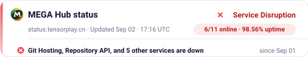
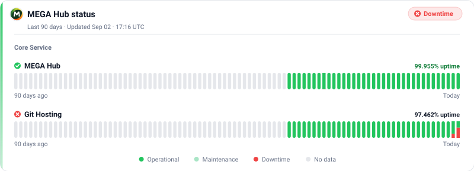

# status-badge-action

[](https://github.com/marketplace/actions/status-badge-action)
[](LICENSE)

Generate beautiful SVG status badges from a [Better Stack](https://betterstack.com) status page — with light, dark, and single-file adaptive output.

| Status card | History card |
|---|---|
|  |  |

> Examples generated from `https://status.tensorplay.cn`. Adaptive variants: `status-adaptive.svg`, `status-history-adaptive.svg`.

## Usage

```yaml
- uses: lexing-2026/status-badge-action@v1
  with:
    status_url: https://status.betterstack.com
    title: My status
    output: status.svg
    output_dark: status-dark.svg
    output_adaptive: status-adaptive.svg
    output_history: status-history.svg
    output_history_dark: status-history-dark.svg
    output_history_adaptive: status-history-adaptive.svg
```

See [full workflow example](#full-workflow) below.

## Preview in README

```html
<a href="https://status.betterstack.com">
  <picture>
    <source media="(prefers-color-scheme: dark)" srcset="status-dark.svg" />
    
  </picture>
</a>
```

For a single-file adaptive card, use `status-adaptive.svg` directly.

## Inputs

| Input | Required | Default | Description |
|---|---|---|---|
| `status_url` | **yes** | — | Better Stack status page URL |
| `title` | no | `System status` | Card title |
| `output` | no | `status.svg` | Light SVG path |
| `output_dark` | no | `status-dark.svg` | Dark SVG path |
| `output_adaptive` | no | *(disabled)* | Single adaptive SVG path |
| `output_history` | no | *(disabled)* | History card SVG path |
| `output_history_dark` | no | *(disabled)* | Dark history card SVG path |
| `output_history_adaptive` | no | *(disabled)* | Adaptive history card SVG path |
| `days` | no | `90` | History window (days) |
| `history_width` | no | `800` | History card width (px) |
| `min_width` | no | `440` | Minimum card width (px) |
| `link` | no | *status page URL* | URL embedded in SVG |
| `show_link` | no | `true` | Embed hyperlink in SVG |
| `show_uptime` | no | `true` | Show uptime pill |
| `show_updated` | no | `true` | Show update timestamp |
| `show_logo` | no | `true` | Embed site logo (falls back to dot) |
| `show_events` | no | `true` | Show latest announcement/incident |
| `static` | no | `false` | Disable pulse animation |

## Features

- **Auto-width** layout that hugs content
- **Site logo** inlined next to the title (stdlib-only PNG downscale, fallback to pulsing dot)
- **Pulsing dot** animation via SMIL (no logo mode)
- **History card** with per-day stacked bars (red=down, green=ok, light green=maintenance, gray=no data); hover for details; shows uptime with 3 decimal places
- **Smart row selection** — history card shows 2 most relevant services, promoting failing ones
- **Announcement/incident** line at the bottom of the status card
- **Light, dark, and adaptive** (prefers-color-scheme) output
- **Services online + uptime** pill
- **Pure Python stdlib** — no third-party dependencies
- **Graceful degradation** on network failure (gray "Status Unavailable" card)

## Full workflow

```yaml
name: Update status badge

on:
  workflow_dispatch:
  schedule:
    - cron: "*/30 * * * *"

permissions:
  contents: write

jobs:
  status:
    runs-on: ubuntu-latest
    steps:
      - uses: actions/checkout@v4
        with:
          ref: gh-pages

      - uses: lexing-2026/status-badge-action@v1
        with:
          status_url: https://status.betterstack.com
          title: MEGA Hub status
          output: status.svg
          output_dark: status-dark.svg
          output_adaptive: status-adaptive.svg
          output_history: status-history.svg
          output_history_dark: status-history-dark.svg
          output_history_adaptive: status-history-adaptive.svg

      - name: Publish
        run: |
          git config user.name "github-actions[bot]"
          git config user.email "41898282+github-actions[bot]@users.noreply.github.com"
          git add status*.svg
          git diff --cached --quiet && exit 0
          git commit -m "chore: update service status"
          git push
```

## License

MIT